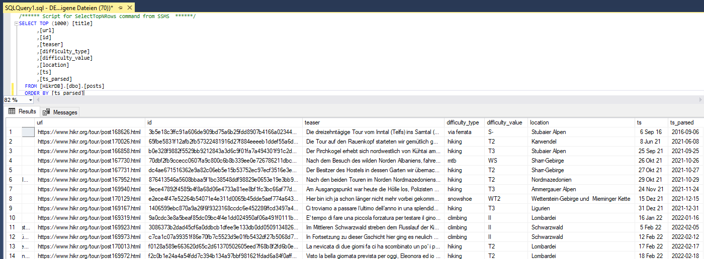

# HikrScraper

Webscraper Implementierung [hikr.org](https://www.hikr.org/) in einem ETL Prozess

Extraction: Data Collection und Extraktion von Daten aus Dokumenten/Posts einer Webseite als Webscraping.
Ziel ist, die Daten passend in tabellarische Form aufzubereiten in einer Transformation, um sie in einer Datenbank zu laden.
Der Load wird mittles ODBC Connection in eine SQL Server Datenbank und dem Schreiben der Daten mittels Cursor durchgeführt.

## Quickstart

requirements: SQL Server database

Lookup auf das Zielbild in der Datenbank


Wir generieren Daten mit einer Scraping-Funktion von einer passenden Webseite, in diesem Fall Hikr.org.
Dazu nutzen wir auch eine genaue Url zur korrekten Darstellung der Webseite ["https://www.hikr.org/tour/"]
Dabei werden die wichtigsten Angaben in Feldern aus dem html-Code extrahiert und sukkzessive exemplarisch als Datenfelder definiert und verarbeitet. (css Selector Extraktion und speichern in Variablen iterativ)
Wir verwenden die google developer tools auf html code Ebene und die Python Library Beautifulsoup [Selektion html Elemente]

Zum Einstieg müssen die Daten flexibel erweiterbar sein bis zur Zielstruktur, wir speichern die Daten in der Variable "result" und im dementsprechend flexiblen Datentyp Dictionary und gehen dann inkrementell vor.


Datenbanktechnisch wird als Primary Key die jewweilige URL eines Post (einer Seite) als Hashkey angelegt, so dass ein eindeutiger Primärschlüssel definiert wird!
```python
result["id"] = hashlib.sha256(url.encode()).hexdigest()#generates hash-id from url
```

Wichtig: Per ODBC Connect auf eine SQL Server Datenbank werden die Daten in der Datenbank geladen.
```python
cnxn = pyodbc.connect('DRIVER={ODBC Driver 17 for SQL Server};SERVER=DESKTOP-LAKDS51;DATABASE=HikrDB;Trusted_Connection=yes;')
cur = cnxn.cursor()
```

Mit SQL als Standardmodul in Python kann gewissermaßen embedded in die Datenbank in sql geschrieben werden.
Dies hat den Vorteil, dass die gesamte SQL Funktionlität genutzt werden kann, einschließlich Fehlermeldungen aus der Datenbank.
```python
import requests
import re
import hashlib
import pyodbc

from bs4 import BeautifulSoup
from pprint import pprint
from datetime import datetime
from dataclasses import dataclass
from typing import Optional

@dataclass
class Result:
    title: Optional[str] = None
    url: Optional[str] = None
    id: Optional[str] = None
    teaser: Optional[str] = None
    difficulty_type: Optional[str] = None
    difficulty_value: Optional[str] = None
    location: Optional[str] = None
    ts: Optional[str] = None
    ts_parsed: Optional[datetime] = None

cnxn = pyodbc.connect('DRIVER={ODBC Driver 17 for SQL Server};SERVER=DESKTOP-LAKDS51;DATABASE=HikrDB;Trusted_Connection=yes;')
cur = cnxn.cursor()

URL: str = "https://www.hikr.org/tour/"
r = requests.get(URL)
print(r.status_code)
if r.status_code == 200:
    html = r.text
    soup = BeautifulSoup(html, "html.parser")#Erzeugen eines Objekts der Klasse BS, übergeben html und Angabe des Parsers
    tags = soup.select("#contentmain_swiss .content-list")
    results = []
    print(len(tags))
    for tag in tags:
        result = Result()
        title = tag.select_one("strong a").text
        title = title.replace("\n","")
        result.title = title
        url = tag.select_one("strong a").get("href")
        result.url = url
        result.id = hashlib.sha256(url.encode()).hexdigest()#Generiert hash-id aus der Url
        teaser = tag.select_one(".content-list-intern_div").text
        teaser = teaser.replace("\n"," ")
        teaser = teaser.replace("\t"," ")
        teaser = teaser.replace("\r"," ")
        teaser = re.sub(r"\s{2,}"," ",teaser)
        teaser = teaser.strip()
        result.teaser = teaser
        print("-----")
        #nicht generisch sondern exemplarisch Arbeiten hier, um alle Sonderfälle einfach hinzufügen zu können [weniger Aufwand]
        for cell in tag.select(".content-list-intern_table td > span") + tag.select(".content-list-intern_table td > div"):
            attr = cell.get("title")
            if attr == "Wandern Schwierigkeit":
                result.difficulty_type = "hiking"
                result.difficulty_value = cell.text.strip()
            elif attr is None:
                result.location = cell.text.replace("\n","")
            elif attr == "Hochtouren Schwierigkeit":
                result.difficulty_type = "touring"
                result.difficulty_value = cell.text.strip()
            elif attr == "Klettern Schwierigkeit":
                result.difficulty_type = "climbing"
                result.difficulty_value = cell.text.strip()
            elif attr == "Tour Datum":
                ts = cell.text.replace("\n","").replace("\t","")
                result.ts = ts
                monate = ["Jan","Feb","Mär","Apr","Mai","Jun","Jul","Aug","Sep","Okt","Nov","Dez"]
                for i, monat in enumerate(monate):
                    ts = ts.replace(monat, f'{i+1}')#Formatstring rechnet die Monate durch und ersetzt 1, 2, usw.
                result.ts_parsed = datetime.strptime(ts,"%d %m %y")
            elif attr == "Ski Schwierigkeit":
                result.difficulty_type = "skiing"
                result.difficulty_value = cell.text.strip()
            elif attr == "Schneeshuhtouren Schwierigkeit": # da Schreibfehler, wäre bei korrekt geschr.Ergebnis hier ein or fällig
                result.difficulty_type = "snowshoe"
                result.difficulty_value = cell.text.strip()
            elif attr == "Mountainbike Schwierigkeit":
                result.difficulty_type = "mtb"
                result.difficulty_value = cell.text.strip()
            elif attr == "Ohne Datum": #könnte aktuelles Datum sein, oder pass wenn es None sein soll!
                pass
            elif attr == "Klettersteig Schwierigkeit":
                result.difficulty_type = "via ferrata"
                result.difficulty_value = cell.text.strip()
            else:
                print(cell)
                assert False, f"'{attr}' not implemented"
        if result.difficulty_type is not None and result.difficulty_value is not None:
            result.difficulty_type = "unknow"
            result.difficulty_value = "unknow"
        results.append(result)
for result in results: 
    pprint(result)# result ist dict und wird im pprint aufgefächert
    #print(len(result["teaser"]))
    #print(len(result["teaser"].encode("latin-1")))
    sql = """
        IF NOT EXISTS (SELECT TOP 1 * FROM posts WHERE id = ?)
        BEGIN
        INSERT INTO posts(
            title,
            url,
            id,
            teaser,
            difficulty_type,
            difficulty_value,
            location,
            ts,
            ts_parsed
        ) values(
            ?,
            ?,
            ?,
            ?,
            ?,
            ?,
            ?,
            ?,
            ?)--geändert in Formatmethode für strings
        END
        ELSE
        BEGIN
            UPDATE posts
            SET title = ?
            WHERE id = ?;
        END
    """
    cur.execute(sql,
        result.id,
        result.title,
        result.url,
        result.id,
        result.teaser,
        result.difficulty_type,
        result.difficulty_value,
        result.location,
        result.ts,
        result.ts_parsed,
        result.title,
        result.id
    )

cnxn.commit()#nicht eingerückt aus performancegründen [Transaktionsmodus einer DB]
cnxn.close()
```

